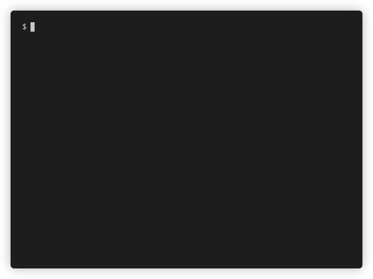

# kdef

[](https://github.com/peter-evans/kdef/actions/workflows/ci.yml)
[](https://goreportcard.com/report/github.com/peter-evans/kdef)
[](https://godoc.org/github.com/peter-evans/kdef)

kdef aims to provide an easy way to manage resources in a Kafka cluster by having them defined explicitly in a human-readable format.
Changes to resource definitions can be reviewed like code and applied to a cluster.

kdef was designed to support being run in a CI-CD environment, allowing teams to manage Kafka resource definitions in source control with pull requests (GitOps).



## Features

- Definition support for:
    - Topics
    - ACLs
    - Per-broker configs
    - Cluster-wide broker configs
- YAML and JSON definition formats
- TLS and SASL mechanisms (PLAIN, SCRAM, AWS_MSK_IAM)
- CLI scripting support (input via stdin, JSON output, etc.)

## Compatibility

kdef uses Kafka broker APIs.
These are the minimum Kafka versions required to apply each definition kind.

- `acl` (Kafka 0.11.0+)
- `broker` (Kafka 0.11.0+)
- `brokers` (Kafka 0.11.0+)
- `topic` (Kafka 2.4.0+)

## Documentation

See the [manual](https://peter-evans.github.io/kdef) for installation, configuration and usage instructions.

## Installation

For the complete list of installation options see the [manual](https://peter-evans.github.io/kdef).

**homebrew tap**

```sh
brew install peter-evans/kdef/kdef
```

**go install**

```sh
go install github.com/peter-evans/kdef@latest
```

## License

[MIT](LICENSE)
